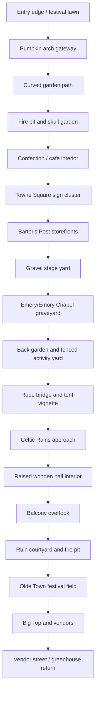

# Evermore Level Blockout Notes

Use this as the first playable blockout plan for the Evermore-style park. The goal is to make the player feel the same route flow as the video before investing in final art.

## Player Route

## Blockout Zones

### 1. Entry and Garden

Start with an open lawn and stone wall/tower silhouette, then force the player through the pumpkin arch. The garden route should feel enclosed: tight bends, low stone retaining walls, planting beds, and frequent props at the edges.

Scale priority: make path widths narrow enough that the props feel close, but keep two NPCs or a party of players able to pass.

### 2. Towne Square

The village opens up after the garden. Use a stone-paved square with storefronts close to the path, planters, barrels, benches, and chalk/menu boards. Barter's Post is the clearest signed shop facade and should be a major orientation point.

Scale priority: one central plaza with 3-4 facade fronts is more important than exact shop interiors at this stage.

### 3. Chapel and Graveyard

Place the chapel/tower so it is visible from the gravel stage yard before the player reaches it. In front of it, build a seasonal graveyard field with hay bales, jack-o-lantern rows, skull props, and a pumpkin tree.

Scale priority: the chapel tower should be visible over low walls and tents from multiple route points.

### 4. Back Activity Yard

After the chapel, the route becomes rougher: gravel paths, grass, cages/fencing, rustic stalls, and giant pumpkins. The video shows real-world mountains/buildings behind this edge, so use horizon openness here instead of fully enclosing the area.

Scale priority: fewer polished facades, more exposed fencing and activity-lane geometry.

### 5. Rope Bridge and Tent

Build this as a small but memorable set piece: rope posts, a bridge or railed crossing, water/rock edge, a canvas tent, and nautical/ship-wheel props. It connects the activity yard to the ruins.

Scale priority: strong material contrast between rope/canvas/wood and the stone ruins that follow.

### 6. Celtic Ruins and Raised Hall

The ruins need stacked stone wall fragments, arch remains, white columns, dry creek or low water/rock bed, and curved dirt/gravel paths. A raised wooden hall/deck overlooks the ruin courtyard, with a dark curio interior and balcony exits.

Scale priority: verticality matters. The player should look down into the ruins from the wooden balcony, then later walk through the same courtyard below.

### 7. Olde Town / Big Top Return

The route returns into a wider festival field with tents/yurts, Big Top, vendor stalls, string lights, and loose dirt/grass ground. This should feel like release after the tight ruins.

Scale priority: Big Top and vendor street are the visual payoff. Use the giant pumpkin and string lights as repeatable orientation markers.

## Sightline Anchors

Use these as player navigation landmarks:

- Chapel tower: east/right-side beacon visible from the gravel yard and festival field.
- Big Top: center-field beacon visible during the return loop.
- Wooden tower/gazebo on stone wall: entrance/festival edge silhouette.
- Pumpkin arch: entry into the garden route.
- Barter's Post blue shutters: Towne Square shop anchor.
- Raised wooden hall: marker for the ruins loop.

## Material Palette

- Paths: concrete/asphalt in garden, stone pavers in village, gravel/dirt in back yard and ruins.
- Walls: rough stone, stacked stone, low retaining walls, white columns in ruins.
- Buildings: thatch roofs, timber beams, stone bases, blue/green shutters, warm interior light.
- Seasonal overlay: pumpkins, hay bales, skulls, orange props, fog, green/purple uplights.
- Tents: green entrance tents, cream activity tents, red-striped Big Top.

## Build Order

1. Block out the route spine as one continuous playable loop.
2. Place the five beacon silhouettes: tower/gazebo, pumpkin arch, chapel tower, raised hall, Big Top.
3. Add ground materials per zone so the route reads before props.
4. Add facades and major props only at timestamp anchors.
5. Run a first-person walkthrough and compare against the timestamp table in `Docs/EVERMORE_PARK_VIDEO_WALKTHROUGH.md`.
6. Only after the route feels correct, add dense prop dressing.
